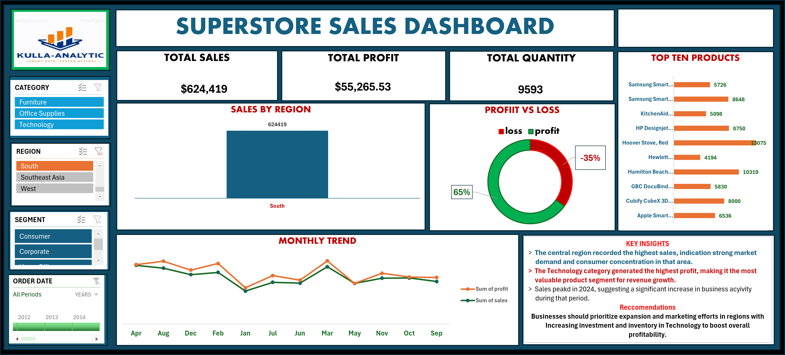

# 📊 Superstore Sales Dashboard (Excel Project)

## 📌 Overview
This project presents an **interactive Superstore Sales Dashboard** built using **Microsoft Excel**.  
It provides a comprehensive analysis of sales performance across regions, product categories, and time, enabling data-driven decision-making.

---

## 🎯 Objectives
- Monitor **overall sales, profit, and quantity**
- Identify **top-performing products**
- Analyze **regional sales distribution**
- Track **monthly sales and profit trends**
- Evaluate **profit vs loss performance**
- Generate actionable **business insights and recommendations**

---

## 🛠️ Tools & Techniques Used
- Microsoft Excel  
- Pivot Tables & Pivot Charts  
- Slicers (Interactive Filters)  
- Data Cleaning & Transformation  
- Dashboard Design & Visualization  

---

## 📷 Dashboard Preview

---

## 📊 Key Metrics
- **Total Sales:** $4,865,671  
- **Total Profit:** $577,692.29  
- **Total Quantity Sold:** 69,449  

---

## 🔍 Dashboard Features

### 🔹 Interactive Filters
- **Category:** Furniture, Office Supplies, Technology  
- **Region:** South, Southeast Asia, West, etc.  
- **Segment:** Consumer, Corporate, Home Office  
- **Order Date:** Year-based filtering  

---

### 🔹 Visualizations
- 📌 **Sales by Region** – Bar chart showing regional performance  
- 📌 **Profit vs Loss** – Donut chart (72% Profit vs 28% Loss)  
- 📌 **Top 10 Products** – Best-selling products by sales  
- 📌 **Monthly Trend** – Line chart showing sales and profit trends over time  

---

## 📈 Key Insights
- The **Central region** recorded the highest sales, indicating strong market demand and customer concentration.  
- The **Technology category** generated the highest profit, making it the most valuable segment for revenue growth.  
- Overall business performance is strong with **72% profit vs 28% loss**.  
- Monthly trends show fluctuations, with noticeable peaks indicating periods of high business activity.  

---

## 💡 Recommendations
- Increase investment in **Technology products** to maximize profitability  
- Expand operations and marketing in **high-performing regions**  
- Improve strategies in underperforming regions to boost sales  
- Leverage monthly trends for better **forecasting and inventory planning**  

---

## 📂 Project Structure

Superstore-Sales-Dashboard/
│
├── data/
│ └── superstore_raw_data.xlsx
│
├── dashboard/
│ └── Superstore_Sales_Dashboard.xlsx
│
├── assets/
│ └── dashboard-preview.png
│
├── README.md
└── LICENSE

---

## 🚀 How to Use
1. Download the Excel dashboard file from this repository  
2. Open using **Microsoft Excel (2016 or later)**  
3. Use the slicers to filter and interact with the dashboard  
4. Explore insights dynamically  

---

## 📌 Author
**Kulla-Analytic**  
📧 kullasamuel@gmail.com  
📞 09077305691  

---

## ⭐ Support
If you found this project helpful:
- Star ⭐ the repository  
- Share with others  
- Provide feedback  

---
